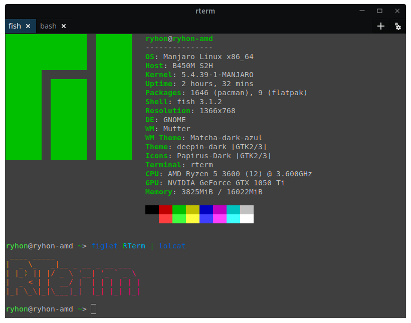

# RTerm

RTerm is a cross-platform multi-tab terminal written in D using GTK3 and VTE. Inspired by [Windows Terminal](https://github.com/Microsoft/Terminal) and [King's Cross](https://source.puri.sm/Librem5/kgx)


## Platform support
| Platform | Supported | Notes |
|-|:-:|-|
| Linux | ✅ |  |
| OSX | ✅ |  |
| Windows | ❌ | [VTE cannot be built for Win32](https://gitlab.gnome.org/GNOME/vte/-/issues/86) |

## Versions
Versions in RTerm are used to enable or disable features.
Edit `versions` in [dub.json](dub.json) to enable versions, e.g. 
```json
    "versions": [
		"-version=CSSEdit"
	],
```   
This will enable the GSV CSS editor, to disable it, remove the line  
```json
    "versions": [],
```  

Here's a list of all versions
| Version | Notes |
|-|-|
|CSSEdit|Uses GTKSourceView instead of TextView to edit CSS in settings. Optional due to long loading times.|

## Building
See [BUILDING.md](BUILDING.md)

## Licenses
RTerm - [GNU GPLv3](LICENSE.md)

[GtkD](https://github.com/gtkd-developers/GtkD) - [GNU LGPLv3](https://github.com/gtkd-developers/GtkD/blob/master/COPYING)

[yajl-d](https://github.com/Ryhon0/yajl-d) - [Boost Software License, Version 1.0](https://github.com/Ryhon0/yajl-d#copyright)